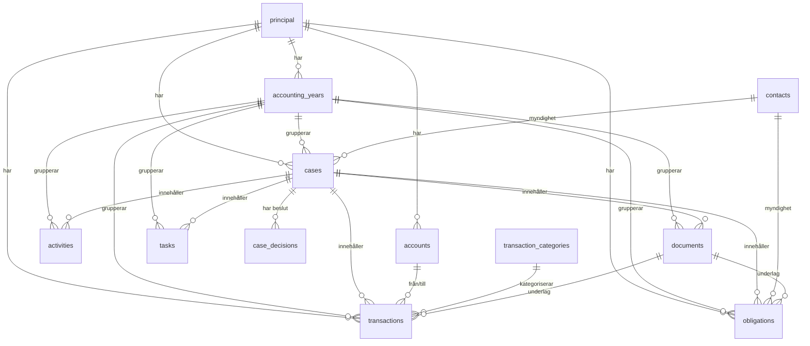

# Care Assistant — Datamodell

Beskrivning av public-schemat i databasen. Endast struktur (kolumner + relationer). Se `docs/ARCHITECTURE.md` för domänbeskrivning.

Alla tabeller har `owner_id` (ägaren/god man) samt `created_at` och `updated_at` (`timestamptz`, default `now()`).

---

## ER-diagram

---

## Tabeller

### principal
Huvudmannen som god man företräder.

| Kolumn | Typ | Null | Default |
|---|---|---|---|
| id | uuid | NO | gen_random_uuid() |
| owner_id | uuid | NO | |
| full_name | text | NO | |
| personal_number | text | YES | |
| address | text | YES | |
| postal_code | text | YES | |
| city | text | YES | |
| phone | text | YES | |
| email | text | YES | |
| notes | text | YES | |
| created_at | timestamptz | NO | now() |
| updated_at | timestamptz | NO | now() |

### accounting_years
Redovisningsår per huvudman.

| Kolumn | Typ | Null | Default | Not |
|---|---|---|---|---|
| id | uuid | NO | gen_random_uuid() | |
| owner_id | uuid | NO | | |
| principal_id | uuid | NO | | → principal.id |
| year | integer | NO | | |
| status | text | NO | 'active' | |
| notes | text | YES | | |
| created_at | timestamptz | NO | now() | |
| updated_at | timestamptz | NO | now() | |

### accounts
Bank- och tillgångskonton.

| Kolumn | Typ | Null | Default | Not |
|---|---|---|---|---|
| id | uuid | NO | gen_random_uuid() | |
| owner_id | uuid | NO | | |
| principal_id | uuid | NO | | → principal.id |
| name | text | NO | | |
| bank_name | text | YES | | |
| account_number | text | YES | | |
| account_type | text | NO | 'bank' | |
| opening_balance | numeric | NO | 0 | |
| opening_balance_date | date | YES | | |
| notes | text | YES | | |
| created_at | timestamptz | NO | now() | |
| updated_at | timestamptz | NO | now() | |

### contacts
Kontakter (myndigheter, anhöriga, vård m.fl.).

| Kolumn | Typ | Null | Default |
|---|---|---|---|
| id | uuid | NO | gen_random_uuid() |
| owner_id | uuid | NO | |
| name | text | NO | |
| category | text | YES | |
| organization | text | YES | |
| phone | text | YES | |
| email | text | YES | |
| address | text | YES | |
| postal_code | text | YES | |
| city | text | YES | |
| notes | text | YES | |
| created_at | timestamptz | NO | now() | |
| updated_at | timestamptz | NO | now() | |

### cases
Ärenden — den centrala arbetsenheten i systemet.

| Kolumn | Typ | Null | Default | Not |
|---|---|---|---|---|
| id | uuid | NO | gen_random_uuid() | |
| owner_id | uuid | NO | | |
| principal_id | uuid | NO | | → principal.id |
| accounting_year_id | uuid | NO | | → accounting_years.id |
| title | text | NO | | |
| description | text | YES | | |
| category | text | YES | | |
| life_area | text | NO | 'other' | |
| authority_contact_id | uuid | YES | | → contacts.id |
| status | text | NO | 'active' | active/waiting/completed... |
| priority | text | NO | 'medium' | |
| start_date | date | YES | | |
| due_date | date | YES | | |
| completed_date | date | YES | | |
| notes | text | YES | | |
| created_at | timestamptz | NO | now() | |
| updated_at | timestamptz | NO | now() | |

### case_decisions
Beslut som fattats inom ett ärende.

| Kolumn | Typ | Null | Default | Not |
|---|---|---|---|---|
| id | uuid | NO | gen_random_uuid() | |
| owner_id | uuid | NO | | |
| case_id | uuid | NO | | → cases.id |
| decision_date | date | NO | CURRENT_DATE | |
| title | text | NO | | |
| description | text | YES | | |
| created_at | timestamptz | NO | now() | |
| updated_at | timestamptz | NO | now() | |

### activities
Loggade aktiviteter (samtal, möten, åtgärder).

| Kolumn | Typ | Null | Default | Not |
|---|---|---|---|---|
| id | uuid | NO | gen_random_uuid() | |
| owner_id | uuid | NO | | |
| accounting_year_id | uuid | YES | | → accounting_years.id |
| case_id | uuid | YES | | → cases.id |
| activity_date | date | NO | CURRENT_DATE | |
| title | text | NO | | |
| description | text | YES | | |
| category | text | YES | | |
| tags | text[] | YES | '{}' | |
| created_at | timestamptz | NO | now() | |
| updated_at | timestamptz | NO | now() | |

### tasks
Uppgifter/att-göra med deadline.

| Kolumn | Typ | Null | Default | Not |
|---|---|---|---|---|
| id | uuid | NO | gen_random_uuid() | |
| owner_id | uuid | NO | | |
| accounting_year_id | uuid | YES | | → accounting_years.id |
| case_id | uuid | YES | | → cases.id |
| title | text | NO | | |
| description | text | YES | | |
| deadline | date | YES | | |
| priority | text | NO | 'medium' | |
| status | text | NO | 'open' | |
| created_at | timestamptz | NO | now() | |
| updated_at | timestamptz | NO | now() | |

### documents
Uppladdade dokument (lagras i storage-bucket `documents`).

| Kolumn | Typ | Null | Default | Not |
|---|---|---|---|---|
| id | uuid | NO | gen_random_uuid() | |
| owner_id | uuid | NO | | |
| accounting_year_id | uuid | YES | | → accounting_years.id |
| case_id | uuid | YES | | → cases.id |
| title | text | NO | | |
| category | text | YES | | |
| document_date | date | YES | | |
| comment | text | YES | | |
| storage_path | text | NO | | sökväg i storage |
| file_name | text | YES | | |
| mime_type | text | YES | | |
| size_bytes | bigint | YES | | |
| created_at | timestamptz | NO | now() | |
| updated_at | timestamptz | NO | now() | |

### obligations
Beslut, tillstånd och skyldigheter som kräver uppföljning.

| Kolumn | Typ | Null | Default | Not |
|---|---|---|---|---|
| id | uuid | NO | gen_random_uuid() | |
| owner_id | uuid | NO | | |
| principal_id | uuid | NO | | → principal.id |
| accounting_year_id | uuid | NO | | → accounting_years.id |
| case_id | uuid | YES | | → cases.id |
| authority_contact_id | uuid | YES | | → contacts.id |
| document_id | uuid | YES | | → documents.id |
| title | text | NO | | |
| obligation_type | text | NO | 'other' | |
| status | text | NO | 'active' | active/pending/expired... |
| decision_date | date | YES | | |
| valid_from | date | YES | | |
| valid_until | date | YES | | |
| renewal_date | date | YES | | |
| reminder_days_before | integer | NO | 30 | |
| notes | text | YES | | |
| created_at | timestamptz | NO | now() | |
| updated_at | timestamptz | NO | now() | |

### transaction_categories
Kategorier för transaktioner.

| Kolumn | Typ | Null | Default |
|---|---|---|---|
| id | uuid | NO | gen_random_uuid() |
| owner_id | uuid | NO | |
| name | text | NO | |
| kind | text | NO | income/expense |
| created_at | timestamptz | NO | now() |
| updated_at | timestamptz | NO | now() |

### transactions
Ekonomiska transaktioner.

| Kolumn | Typ | Null | Default | Not |
|---|---|---|---|---|
| id | uuid | NO | gen_random_uuid() | |
| owner_id | uuid | NO | | |
| principal_id | uuid | NO | | → principal.id |
| accounting_year_id | uuid | YES | | → accounting_years.id |
| account_id | uuid | NO | | → accounts.id |
| counter_account_id | uuid | YES | | → accounts.id (motkonto vid överföring) |
| category_id | uuid | YES | | → transaction_categories.id |
| document_id | uuid | YES | | → documents.id |
| case_id | uuid | YES | | → cases.id |
| transaction_date | date | NO | CURRENT_DATE | |
| type | text | NO | | income/expense/transfer |
| amount | numeric | NO | | belopp i kr, två decimaler |
| comment | text | YES | | |
| created_at | timestamptz | NO | now() | |
| updated_at | timestamptz | NO | now() | |

---

## Relationsöversikt

| Från | Kolumn | → | Till |
|---|---|---|---|
| accounting_years | principal_id | → | principal.id |
| accounts | principal_id | → | principal.id |
| activities | accounting_year_id | → | accounting_years.id |
| activities | case_id | → | cases.id |
| case_decisions | case_id | → | cases.id |
| cases | principal_id | → | principal.id |
| cases | accounting_year_id | → | accounting_years.id |
| cases | authority_contact_id | → | contacts.id |
| documents | accounting_year_id | → | accounting_years.id |
| documents | case_id | → | cases.id |
| obligations | principal_id | → | principal.id |
| obligations | accounting_year_id | → | accounting_years.id |
| obligations | case_id | → | cases.id |
| obligations | authority_contact_id | → | contacts.id |
| obligations | document_id | → | documents.id |
| tasks | accounting_year_id | → | accounting_years.id |
| tasks | case_id | → | cases.id |
| transactions | principal_id | → | principal.id |
| transactions | accounting_year_id | → | accounting_years.id |
| transactions | account_id | → | accounts.id |
| transactions | counter_account_id | → | accounts.id |
| transactions | category_id | → | transaction_categories.id |
| transactions | document_id | → | documents.id |
| transactions | case_id | → | cases.id |
